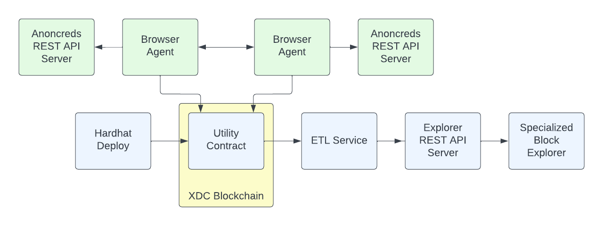

# Canon

The Canon project was started to provide an alternative to the Hyperledger Indy project.  Hyperledger Indy is the blockchain component that supports Hyperledger Aries verifiable credentials.  As the developers of this project we were concerned about the following problems we saw with Hyperledger Indy:

1.  Indy is based on the Plenum blockchain.  Plenum does not support smart contracts, has very little documentation, limited tool support, and a very small number of maintainers.
2. To communicate to Indy, Aries needs to use a library in Rust (Indy-VDR) that requires knowledge of Rust to connect to and to maintain.
3. Indy is slow on writes and maxes out at around 25 nodes.
4. There is very little documentation on hosting Indy nodes and it requires specialized cloud knowledge to host and secure it.

Our project team looked at alternatives and decided that an EVM compatible blockchain would be the best option to replace Plenum.  We decided against Ethereum as the main net gas fees are very high and the high traffic slows down the transaction finalization times.  We decided to try out XDC for the following reasons:

- XDC is aimed at enterprise users.  Enterprise users will need verifiable credentials in their transactions for on-chain verification of off-chain information like identity, certifications, and 3rd party claims.
- XDC is EVM, node, and Metamask compatible.
- XDC has low gas fees
- XDC has a test network and allows for private networks

As we explored building Canon we realized some strong advantages to our approach:

- We can add a Trust Registry as a smart contract for each schema and/or credential definition
- We can move away from the Indy-style Revocation Registry that depends on the cumbersome Cryptographic Accumulators and Tails Files and move to use zkSnarks.
- We can add a governance token to provide network development governance
- We can use a smart contract to provide a common record of mappings that can be used in a social key recovery method for supporting lost, stolen, or broken mobile wallets
- Having the verification data on-chain should allow for smart contracts to verify credentials.  This can provide a level of credential-based access to smart contracts.

# Canon Architecture Overview

### Utility Smart Contract

The Utililty.sol smart contract replaces a large part of what Hyperledger Indy provides.  It holds the public NYMs, credential schemas, and credential definitions.  It uses a role access to support which accounts can write to the mappings in the contract.  The Aries DIDs are now represented using XDC Account IDs.  

### Hardhat Deploy

We use Hardhat to compile and deploy the Utility contract.

### ETL Service

The ETL service listens for notifications and reads blocks to look for transactions that are registering NYMs, Schemas, and CredDefs to the Utility Contract.

### Explorer REST API Server

This server takes the data from the ETL and stores it in a Mongo database.  It provides a REST API that allows for the retrieval of NYMs, Schemas, and CredDefs with filtering support.

### Explorer Web UI

This is a Web interface for exploring all of the NYMs, schemas, and CredDefs written to the Utility contract.  This is required as the contract uses mappings and the mappings in Solidity cannot be iterated through.  Also, the list can get very large.  Having a web interface like this helps in debugging, testing, and in designing new Schemas and reusing Schemas for CredDefs.